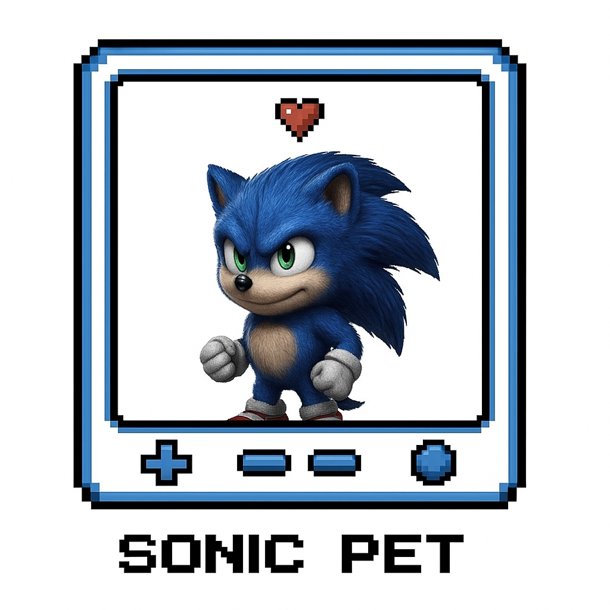
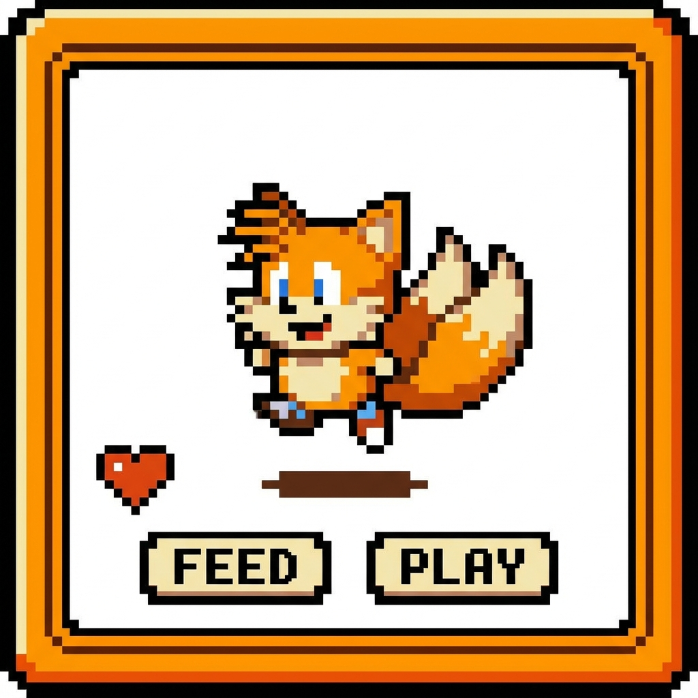
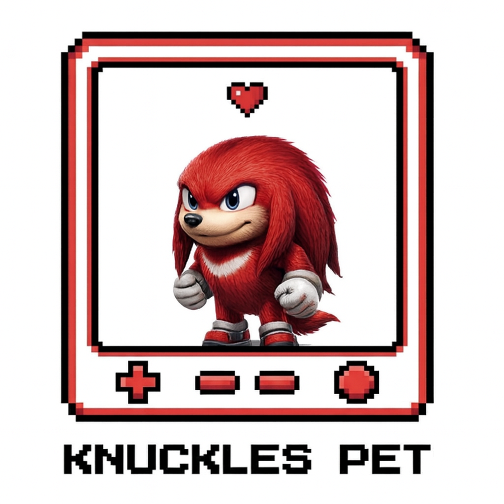
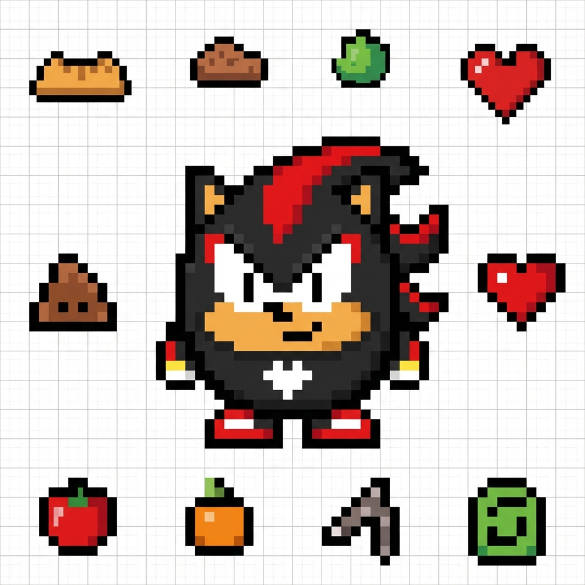
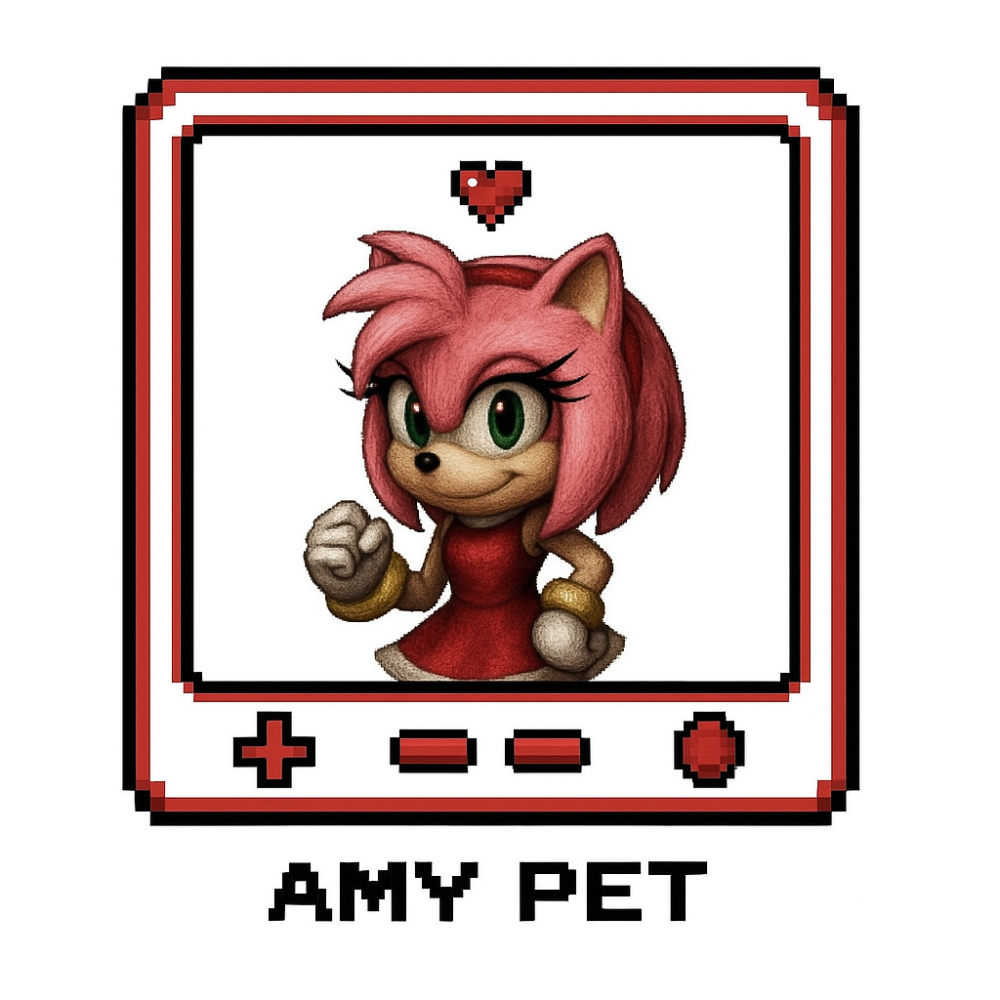

# Discord Bot

## Overview


My name is **Sonic**, and this is the me version of the bot — fast, fearless, and packed with more features than rings in a bonus stage! This Discord bot is way past cool! Built with Discord.js at lightning speed, it delivers a whole bundle of awesome — algorithm tricks, number-crunching math moves, handy utilities, fun entertainment commands, and even a full-on economy with casino-style games.

> "Gotta go fast!" 💙⚡️

---

## Features

### 🐾 Virtual Pet System (NEW!)

Adopt and raise your own virtual companions! Choose your favorite character and start your journey.

| **Sonic** | **Tails** | **Knuckles** | **Shadow** | **Amy** |
| :---: | :---: | :---: | :---: | :---: |
|  |  |  |  |  |

**Commands:**
- **`/adopt`**: Choose your partner from the roster above.
- **`/pet-action`**: Care for them!
  - 🍎 **Feed**: Keep them full.
  - 🎾 **Play**: Boost happiness.
  - ⚔️ **Grind**: Send them to work to earn coins.
  - 💤 **Sleep**: Restore energy.
- **`/pet-list`**: View your collection.
- **`/sell-pet`**: Find them a new home.

---

### 💰 Economy & Shop

Become the richest hedgehog in the server!

- **💸 Balance**: Check your wallet (`/balance`)
- **📅 Daily**: Claim free coins every 24 hours (`/daily`)
- **🧠 Work**: Earn coins by answering trivia questions (`/work`)
- **🎁 Give**: Transfer coins to friends (`/give`)
- **🛍️ Shop**: Buy items like Shields, Repair Kits, and Pet Food (`/shop`, `/buy`)
- **🎒 Inventory**: Manage your items (`/inventory`)

**Items:**
- 🛡️ **Shield**: Protect yourself from robbery.
- 🔫 **Gun**: For... aggressive negotiations (`/shoot`).
- 🔧 **Repair Kit**: Fix your broken shield.

---

### 🎮 Fun & Games


- **🃏 Blackjack**: High-stakes casino game with a rich UI (`/blackjack`).
- **⛏️ Mining**: Dig for gems and resources (`/mine`).
- **😵 Hangman**: Classic word guessing game (`/hangman`).
- **🧩 Sudoku**: Solve Sudoku puzzles (`/sudoku`).
- **🤔 Riddles**: Solve brain teasers (`/riddle`).
- **🔐 Cipher**: Encode and decode secret messages (`/cipher`).
- **🤣 Meme**: Get random memes from Giphy (`/meme`).
- **🦔 Shadow**: Special interactions (`/shadow`).
- **🕵️ Steal**: Attempt to steal coins (`/steal`).

<br clear="right"/>

---

### 🤖 AI & Education

- **🧠 ChatGPT**: Chat with an AI assistant (`/learnai`).
- **📚 Learn**: Get detailed explanations for various topics (`/learn`).
- **💻 Data Structures**: Learn about Computer Science concepts (`/datastructure`).
- **❓ Trivia**: Test your knowledge (`/trivia`).

---

### 🧮 Mathematics

- **Basic**: Add, Subtract, Multiply, Divide.
- **Advanced**: Square Root, Logarithms, Integration (`/functionntergrate`).
- **Trigonometry**: Sine, Cosine, Tangent.
- **Calculate**: Evaluate complex expressions (`/calculate`).

---

### 🛠️ Utilities

- **☀️ Weather**: Get real-time weather for any city (`/weather`).
- **🌐 Translate**: Translate text between languages (`/translate`).
- **🍎 Food**: Get nutrition info for food items (`/food`).
- **⏰ Time**: Check current time in any timezone (`/time`).
- **👤 User Info**: Get details about a user (`/userinfo`).
- **🖼️ Avatar**: View user avatars (`/avatar`).
- **🏓 Ping**: Check bot latency (`/ping`).

---

### 🛡️ Moderation

- **🚫 Ban/Unban**: Manage server bans.
- **👢 Kick**: Kick users from the server.
- **🔇 Timeout/Untimeout**: Mute and unmute users.
- **🧹 Purge**: Bulk delete messages.

---

## Installation

### Prerequisites
- Node.js version 20.17.0 or higher
- A Discord Bot Token
- A MongoDB Atlas Connection String

### Setup Steps

1. **Clone the repository:**
   ```bash
   git clone <repository-url>
   cd DiscordBot
   ```

2. **Install dependencies:**
   ```bash
   npm install
   ```

3. **Configure environment variables:**
   Create a `.env` file in the `src` directory:
   ```
   TOKEN=your_discord_bot_token
   MONGODB_URI=your_mongodb_connection_string
   API_KEY=your_openai_api_key
   MEME_API=your_giphy_api_key
   WEATHER_API=your_openweather_api_key
   FOOD_API=your_nutritionix_api_key
   FOOD_APPID=your_nutritionix_app_id
   ```

4. **Configure server settings:**
   Edit `config.json`:
   ```json
   {
     "testServer": "your_test_server_id",
     "devs": ["your_discord_user_id"]
   }
   ```

### Database Integration
This bot uses **MongoDB** to store all user data, including:
- **Economy**: Balances, inventory, and daily claim timers.
- **Pets**: Pet stats, ownership, and health status.
- **Settings**: User-specific configurations.

The `src/utils/Database.js` file handles the connection. Ensure your IP is whitelisted in your MongoDB Atlas cluster settings.

## Running the Bot

**Standard Mode:**
```bash
cd src
node index.js
```

**Development Mode:**
```bash
cd src
npx nodemon index.js
```

## Project Structure
```
DiscordBot/
├── src/
│   ├── commands/       # All bot commands organized by category
│   ├── events/         # Event handlers (ready, interactionCreate)
│   ├── utils/          # Utility classes (Database, Economy, Pets)
│   ├── data/           # Backup JSON files (migrated to SQLite)
│   ├── Images/         # Assets
│   └── index.js        # Entry point
├── database.sqlite     # Legacy SQLite Database (Migrated to MongoDB)
├── config.json         # Configuration
└── README.md           # Documentation
```

---

<div align="center">
  
  <p>Made with 🌭 and Chili Dogs</p>
</div>


https://github.com/user-attachments/assets/8db0a6f5-c72e-4ecf-b7d0-f9b14050c379